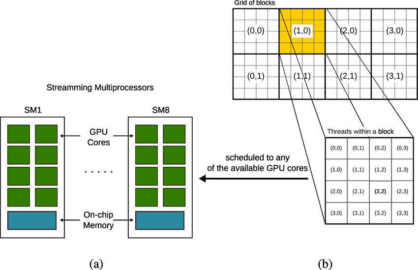

# CUDA Mini-Workshop

An introductory workshop to learn about compiling, running and tuning simple CUDA programs on RHEL.

## Overview

CUDA is a platform and programming model for NVIDIA CUDA-enabled GPUs that exposes the hardware for general 
purpose computing use cases. It provides a C/C++ language extension and APIs for programming and managing GPU
resources.

The CUDA API/SDK is a vector programming model that is close to the GPU hardware.
Higher level AI/ML frameworks such as PyTorch and Tensorflow
are built on top of CUDA to achieve AI/ML training and inference acceleration.

#### Why learn CUDA basics?

You don't need to know CUDA to sell Openshift or train ML models, but it will give you
a better appreciation for how GPUs work and the advantages they bring to AI engineers.
Besides, its nerdy fun.

#### Setup

- You will need a github account.
- [Complete these prerequisites](https://gist.github.com/bkoz/310ec8137b0191ec0122adf918132dac)

#### CUDA Programming Basics

A GPU has a fixed number of streaming multiprocessors (SMs) which contain
numerous CUDA cores, caches and shared memory, all working together to execute instructions from many threads in parallel, significantly accelerating complex computational tasks. 



The diagram above illustrates the fundamental concepts in GPU architecture and parallel processing. 

Part (a) shows a high-level view of a GPU with multiple **Streaming Multiprocessors** (SMs), each containing several **GPU Cores** and **On-chip Memory**. These SMs are the primary processing units of the GPU. 

Part (b) demonstrates how a computational task is organized for execution on this hardware. A large problem is broken down into a **Grid of blocks**, where each block is an independent unit of work. The highlighted block, labeled (1,0), is then further divided into a grid of individual **threads**. This hierarchical structure—from the entire grid of blocks, down to a single block, and finally to the individual threads within it—is designed to exploit the parallel nature of the GPU. The diagram shows that an entire block of threads is scheduled to be executed on any of the available GPU cores, allowing for massive parallel execution and efficient use of the GPU's resources.

The general workflow is:

In the main program:

1) Allocate CUDA memory
   
2) Copy host variables to CUDA memory
   
3) Create a CUDA kernel function that at a minimum, performs the following:
    - Calculate the global thread index
    - Perform bounds checking before writing to memory. 

4) Choose the number of threads per block (example = 4x4).
5) Calculate 
the grid dimensions Based on the dimensions of the data (4x2).
6) Call the kernel function with the grid and block dimensions.
7) Wait for the threads to syncronize
8) Free the CUDA memory

In the kernel:

1) Determine the global memory index for the given
thread.

#### Complete the following exercises:

- Clone the galaxy guid repo.

```bash
git clone https://github.com/redhat-na-ssa/nvaie-guide.git
```

- Begin by running `make` to build all of the programs.

```bash
cd nvaie-guide/docs/software/cuda/src
make
```

1. Run `./01-mycudadevice` to display the device properties. How much memory does your GPU have? _____

`./01mycudadevice`

- Search for TODO in the `01-mycudadevice.cu` source file and modify the program 
to print out the maximum number of threads per multiproccesor.
See the [CUDA API docs for the correct property to retrieve.](https://docs.nvidia.com/cuda/cuda-runtime-api/structcudaDeviceProp.html#structcudaDeviceProp) 

- What is the theoretical maximum number of simultaneous threads that can execute on your device? _____

2. Run a simple vector add program to confirm the GPU can execute CUDA kernels.

```bash
./02-add_cuda_block
```

3. Complete the example image processing program. This will involve creating a CUDA kernel function and calling it from the main program.

- Run the program. It should create a `gray.png` image file that contains all black pixels.

- Begin by opening `03-rgb2gray.cu`
  - Complete TODO #1 by merging `snippets/convert.cu` into `03-rgb2gray.cu`
  - Run a `make` to confirm that there are no typos.
  - Complete TODO #2 by merging `snippets/call_kernel.cu` into `03-rgb2gray.cu`
  - Run a `make` to confirm that there are no typos.
  - If everything goes well the program should create a `gray.png` image that is visually correct.

4. Run the profiler and take note on the execution time of the `CUDA_KERNEL`.

```bash
nsys_easy ./03-rgb2gray
```

5. Now experiment with different block thread sizes and observe/compare the execution times.

- What is the optimal number of t for your device?

```bash
nsys_easy ./03-rgb2gray -t 8
```

6. Ask the Copilot code assitant to create a new CUDA program that calculates a Mandelbrot or Julia set and saves it as a png file.

#### End of Workshop


###### References

[CUDA overview from SC2011](https://www.nvidia.com/docs/io/116711/sc11-cuda-c-basics.pdf)

[CUDA Tutorial](https://cuda-tutorial.readthedocs.io/en/latest/tutorials/tutorial02/)

https://developer.nvidia.com/blog/even-easier-introduction-cuda/

https://github.com/harrism/mini-nbody.git

